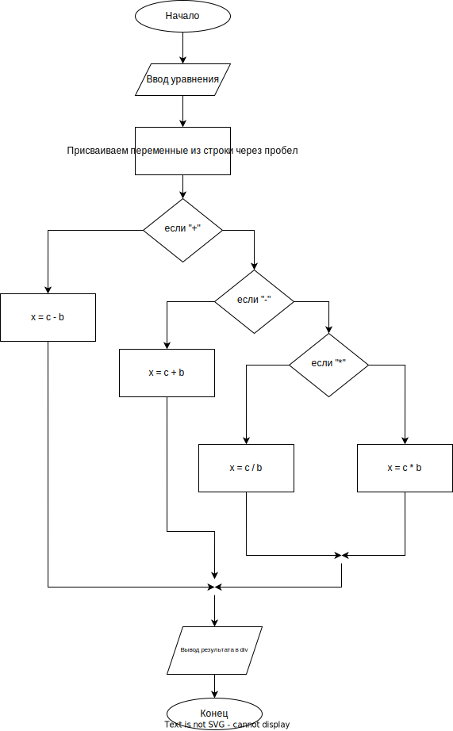

# Курс серверной разработки
## [Сайт курса](http://45.10.42.11:30002/)

## Лабораторная работа №1: "Hello, World!"
### Описание
В рамках этой лабораторной работы была создана простая веб-страница с динамическим контентом. В Header находится логотип МосПолитеха и название работы, а в Footer находится задание для самостоятельной работы. В Main находится html-элемент с примером "Hello, World!".

### Инструкции
Для просмотра выполненной работы можно перейти по ссылке: [Hello, World!](http://dimdimich.ru:30002/lab1.php).

### Итог
В результате выполнения данной лабораторной работы была создана простая веб-страница с динамическим контентом, загруженная в удаленный репозиторий и залитая на хостинг.

## Лабораторная работа №2: "Форма обратной связи"
### Описание
В рамках этой лабораторной работы был создан сайт из двух страниц. На первой странице находится форма обратной связи, отправка которой осуществляется на URL https://httpbin.org/post. Также на первой странице есть кнопка для перехода на вторую страницу. На второй странице выводится результат работы функции get_headers в textarea.

### Инструкции
Для просмотра выполненной работы можно перейти по ссылке:
  - [Форма](http://45.10.42.11:30002/lab2.php)

  - [Получение заголовка](http://45.10.42.11:30002/lab2_2.php)

### Итог
В результате выполнения данной лабораторной работы был создан сайт из двух страниц, включающий форму обратной связи и вывод результата работы функции get_headers на второй странице. Код был загружен в удаленный репозиторий и залит на хостинг.

## Лабораторная работа №3: "Skills presentation"
### Описание
В рамках этой лабораторной работы была подготовлена презентация о моих навыках в программировании и используемых инструментах. В презентации были представлены языки программирования, которые я знаю - Python и JavaScript, а также фреймворк React и CSS-фреймворк Tailwind. Были также упомянуты используемые IDE и текстовые редакторы, такие как Visual Studio Code и PyCharm.

### Инструкции
Для просмотра выполненной работы можно перейти по ссылке на презентацию: [Презентация навыков](http://45.10.42.11:30002/lab3.html).

### Итог
В результате выполнения данной лабораторной работы была подготовлена презентация, отражающая мои навыки в программировании и используемые инструменты. Были рассмотрены языки программирования, фреймворк и CSS-фреймворк, которые я знаю, а также IDE и текстовые редакторы, которые я использую.

## Лабораторная работа №4: "Решение уравнений"
### Описание
В рамках этой лабораторной работы была создана программа для решения заданного уравнения. Программа определяет оператор в уравнении и расположение неизвестной переменной, после чего находит значение переменной.

### Инструкции
Для просмотра выполненной работы можно перейти по ссылке 
(для корректной работы рекомендуется вводит уравнение строго в формате неизвестная оператор переменная = переменная): [Решение уравнений](http://45.10.42.11:30002/lab4.php)

### Блок-схема

### Итог
В результате выполнения данной лабораторной работы была создана программа для решения уравнений, которая может быть использована для решения различных задач в области математики и программирования.

## Лабораторная работа №5: "Калькулятор"
### Описание
В рамках этой лабораторной работы был создан обычный калькулятор с возможностью выполнения арифметических операций: сложение, вычитание, умножение и деление, а также использования скобок для задания порядка операций. Для отображения пользовательского ввода и результата вычислений использовалось поле ввода и поле вывода, которые были сверстаны с помощью HTML и стилизованы с помощью CSS. Кнопки обнуления и выполнения расчета также были добавлены на страницу.

Вся логика вычислений происходит на серверной стороне. При отправке формы на сервер, сервер проверяет корректность введенных пользователем данных и, если они корректны, выполняет рекурсивный вызов пользовательских функций для выполнения указанных операций. Результат вычислений отправляется обратно на страницу в поле вывода.

### Инструкции
Для просмотра выполненной работы можно перейти по ссылке: [Калькулятор](http://45.10.42.11:30002/lab5.html).

### Итог
В результате выполнения данной лабораторной работы был создан простой калькулятор с возможностью выполнения арифметических операций. Калькулятор сверстан с помощью HTML и CSS, а логика вычислений реализована на серверной стороне с использованием PHP. Для проверки корректности введенных данных используются рекурсивные вызовы пользовательских функций. Калькулятор успешно прошел тестирование и готов к использованию.
